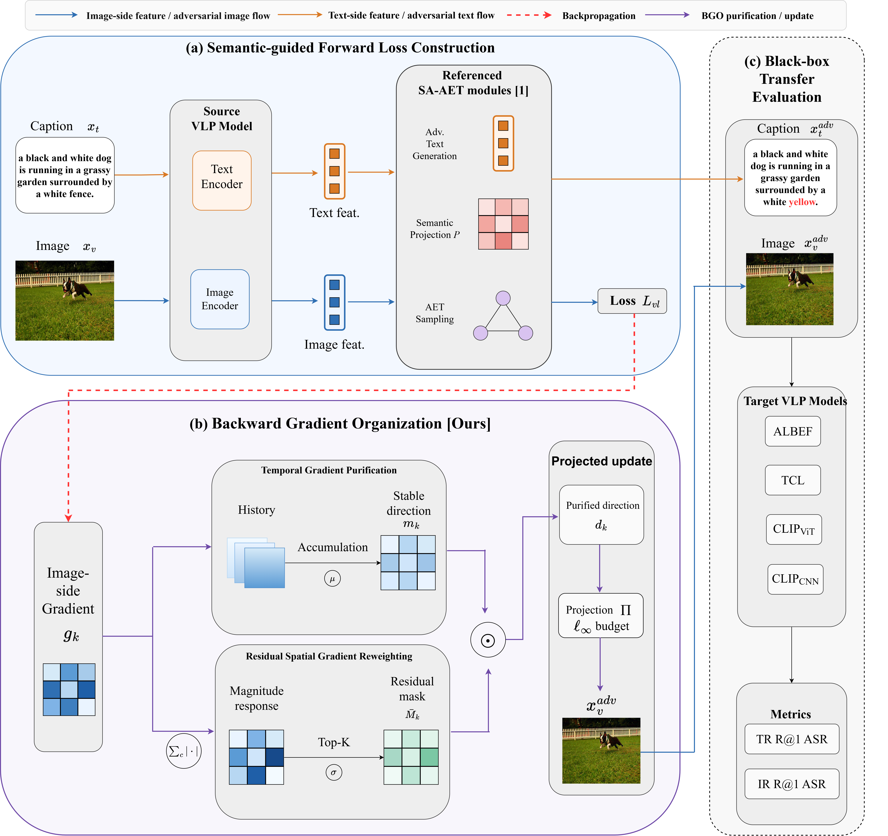

# BGO

Anonymous code release for **BGO: Backward Gradient Organization for Transferable Vision-Language Attacks in Multimodal Search**.

## Brief Introduction

Image-text retrieval is an important component of multimodal search over online content, but the vision-language pre-training (VLP) models used for this task remain vulnerable to transferable adversarial examples. Existing image-text retrieval attacks mainly strengthen the forward attack objective, while the image-side gradients produced by back-propagation are often passed directly to iterative perturbation updates.

BGO treats the back-propagated image-side gradient as an intermediate optimization signal that should be organized before the image update. It combines two backward-stage modules:

- **Temporal Gradient Purification (TGP)** accumulates normalized image-side gradients to attenuate iteration-specific directional variations.
- **Residual Spatial Gradient Reweighting (RSGR)** converts the current gradient magnitude response into a positive residual mask that modulates update strengths across spatial locations while preserving the sign direction supplied by TGP.

The semantic-guided forward objective is instantiated with the adversarial-text generation, adversarial evolution-triangle sampling, and semantic projection components of SA-AET. After back-propagation, TGP and RSGR organize the resulting image-side gradient to form the adversarial-image update direction.

The paper evaluates BGO on Flickr30K and MSCOCO with ALBEF, TCL, CLIP-ViT, and CLIP-CNN. It also reports a post-hoc cross-model analysis of the spatial ranking used by RSGR and an output-only evaluation of BGO-generated adversarial images on GPT-4o, Claude Sonnet 4.6, and Qwen-VL-Max.

<p align="left">
    
</p>

This repository is prepared for anonymous review. Author, affiliation, contact, and final citation information are intentionally omitted and will be restored after review when appropriate.

## Repository Structure

```text
BGO.py                   # BGO attacker: semantic-guided forward loss + TGP/RSGR
eval_BGO.py              # Image-text retrieval transfer evaluation entry
SA_AET.py                # Reproduced SA-AET baseline kept for comparison
eval_AET.py              # SA-AET baseline evaluation entry
configs/                 # Retrieval and model configuration files
models/                  # ALBEF/CLIP/TCL-compatible model code
data_annotation/         # Lightweight evaluation annotations
std_eval_idx/            # Clean rank indices used to compute ASR
refTools/, vqaTools/     # Auxiliary evaluation utilities
images/                  # Framework figure used in the paper and README
```

Large local artifacts are intentionally not included:

```text
data/
checkpoints/
bert-base-uncased/
output/
new_paper_visual/
bgo_text_visual/
visualization/
```

## Quick Start

### 1. Install Dependencies

Python 3.8 is recommended. The main retrieval results were obtained with PyTorch 1.10.0 and CUDA 11.3; the PyTorch 2.1.0 commands are provided for easier setup and may produce minor numerical differences. For strict reproduction of the main retrieval environment, install the matching PyTorch 1.10.0 CUDA 11.3 wheel first and then run `pip install -r requirements.txt --no-deps`.

```bash
pip install torch==2.1.0 torchvision==0.16.0 --index-url https://download.pytorch.org/whl/cu121
pip install -r requirements.txt
```

### 2. Prepare Datasets

Download Flickr30K and MSCOCO, then set the dataset root in the config files:

- Flickr30K: `configs/Retrieval_flickr.yaml`, field `image_root`
- MSCOCO: `configs/Retrieval_coco.yaml`, field `image_root`

The annotation files required by the evaluation scripts are provided in `data_annotation/`. The image files are not included in this anonymous code package. Flickr30K contains about 31K images with five captions per image, and the paper uses the standard 1K test split. MSCOCO contains 123,287 images with five captions per image, and the paper uses the common 5K test split. Images are resized and cropped by the source and target model transforms in `eval_BGO.py`; no additional samples are excluded beyond the standard evaluation split.

Official dataset pages:

- [Flickr30K](https://shannon.cs.illinois.edu/DenotationGraph/)
- [MSCOCO](https://cocodataset.org/#home)

### 3. Prepare Model Weights

Create a local checkpoint directory:

```bash
mkdir checkpoints
```

Download ALBEF checkpoints by following the official ALBEF repository instructions, then place or link the weights to the expected local names:

```text
checkpoints/albef_flickr.pth
checkpoints/albef_coco.pth
```

Official model resources:

- [ALBEF](https://github.com/salesforce/ALBEF)
- [TCL](https://github.com/uta-smile/TCL)
- [CLIP ViT-B/16](https://huggingface.co/openai/clip-vit-base-patch16)
- [BERT base uncased](https://huggingface.co/models?search=bert-base-uncased)

Download TCL checkpoints from the official repository when available. If those links are unavailable, any public mirror of the same fine-tuned weights can be used as long as the local file names match the expected paths below.

Expected local names:

```text
checkpoints/tcl_flickr.pth
checkpoints/tcl_coco.pth
```

CLIP weights are loaded by the CLIP helper and cached locally. BERT can be loaded by passing `bert-base-uncased`; if running offline, download it from Hugging Face and pass the local path through `--source_text_encoder` and `--target_text_encoder`.

## Transferability Evaluation

By default, `--model_list` is `ALBEF,TCL,CLIP_ViT,CLIP_CNN`; adversarial examples are generated on `--source_model` and evaluated on the remaining models. To reproduce the main retrieval matrix, run the evaluation once for each source model:

```text
ALBEF
TCL
CLIP_ViT
CLIP_CNN
```

### Flickr30K

```bash
python eval_BGO.py --config ./configs/Retrieval_flickr.yaml \
    --cuda_id 0 \
    --source_model CLIP_CNN \
    --albef_ckpt ./checkpoints/albef_flickr.pth \
    --tcl_ckpt ./checkpoints/tcl_flickr.pth \
    --original_rank_index_path ./std_eval_idx/flickr30k/
```

### MSCOCO

```bash
python eval_BGO.py --config ./configs/Retrieval_coco.yaml \
    --cuda_id 0 \
    --source_model CLIP_CNN \
    --albef_ckpt ./checkpoints/albef_coco.pth \
    --tcl_ckpt ./checkpoints/tcl_coco.pth \
    --original_rank_index_path ./std_eval_idx/mscoco/
```

The same commands can be repeated with `--source_model ALBEF`, `--source_model TCL`, `--source_model CLIP_ViT`, and `--source_model CLIP_CNN`. For the SA-AET baseline, run `eval_AET.py` under the same dataset, source model, checkpoint, perturbation budget, iteration number, and rank-index settings.

To run all four source models used in the main retrieval matrix:

```bash
for SOURCE in ALBEF TCL CLIP_ViT CLIP_CNN; do
    python eval_BGO.py --config ./configs/Retrieval_flickr.yaml \
        --cuda_id 0 \
        --source_model ${SOURCE} \
        --albef_ckpt ./checkpoints/albef_flickr.pth \
        --tcl_ckpt ./checkpoints/tcl_flickr.pth \
        --original_rank_index_path ./std_eval_idx/flickr30k/ \
        --result_file ./result_bgo_flickr.txt
done

for SOURCE in ALBEF TCL CLIP_ViT CLIP_CNN; do
    python eval_BGO.py --config ./configs/Retrieval_coco.yaml \
        --cuda_id 0 \
        --source_model ${SOURCE} \
        --albef_ckpt ./checkpoints/albef_coco.pth \
        --tcl_ckpt ./checkpoints/tcl_coco.pth \
        --original_rank_index_path ./std_eval_idx/mscoco/ \
        --result_file ./result_bgo_coco.txt
done
```

## Reproducing Main Results

The following tables list the BGO rows reported in the main retrieval matrix. Values are attack success rates at Recall@1; `TR` denotes image-to-text retrieval and `IR` denotes text-to-image retrieval.

### Flickr30K

| Source | Target | TR R@1 ASR | IR R@1 ASR |
| --- | --- | ---: | ---: |
| ALBEF | ALBEF | 99.79 | 99.88 |
| ALBEF | TCL | 95.36 | 95.31 |
| ALBEF | CLIP_ViT | 60.25 | 68.75 |
| ALBEF | CLIP_CNN | 60.15 | 67.62 |
| TCL | ALBEF | 97.60 | 97.80 |
| TCL | TCL | 100.00 | 100.00 |
| TCL | CLIP_ViT | 59.51 | 67.20 |
| TCL | CLIP_CNN | 64.50 | 70.53 |
| CLIP_ViT | ALBEF | 41.40 | 53.93 |
| CLIP_ViT | TCL | 42.36 | 54.62 |
| CLIP_ViT | CLIP_ViT | 100.00 | 99.97 |
| CLIP_ViT | CLIP_CNN | 69.22 | 75.54 |
| CLIP_CNN | ALBEF | 30.34 | 43.69 |
| CLIP_CNN | TCL | 31.40 | 45.81 |
| CLIP_CNN | CLIP_ViT | 62.45 | 69.17 |
| CLIP_CNN | CLIP_CNN | 100.00 | 99.93 |

### MSCOCO

| Source | Target | TR R@1 ASR | IR R@1 ASR |
| --- | --- | ---: | ---: |
| ALBEF | ALBEF | 99.97 | 99.97 |
| ALBEF | TCL | 96.14 | 95.89 |
| ALBEF | CLIP_ViT | 78.48 | 81.85 |
| ALBEF | CLIP_CNN | 78.42 | 82.26 |
| TCL | ALBEF | 97.11 | 97.28 |
| TCL | TCL | 99.97 | 99.97 |
| TCL | CLIP_ViT | 77.57 | 81.70 |
| TCL | CLIP_CNN | 78.05 | 82.64 |
| CLIP_ViT | ALBEF | 61.74 | 69.14 |
| CLIP_ViT | TCL | 60.45 | 67.55 |
| CLIP_ViT | CLIP_ViT | 99.92 | 99.99 |
| CLIP_ViT | CLIP_CNN | 84.63 | 87.93 |
| CLIP_CNN | ALBEF | 49.96 | 60.19 |
| CLIP_CNN | TCL | 52.14 | 61.52 |
| CLIP_CNN | CLIP_ViT | 78.06 | 82.23 |
| CLIP_CNN | CLIP_CNN | 99.96 | 99.96 |

The paper reports the main retrieval results with random seed 42. A repeated-run check additionally evaluates the CLIP_CNN -> CLIP_ViT setting across three random seeds.

## Additional Evaluations Reported in the Paper

The post-hoc RSGR analysis evaluates 100 images for each of four heterogeneous source-target settings on Flickr30K and MSCOCO. Across these settings, source-ranked low-response regions contain 11.21% to 15.65% of the target-gradient magnitude, compared with 20.30% to 20.34% for equal-area shuffled regions; the mean source-target Spearman rank correlations range from 0.407 to 0.735. Target-model gradients are used only for this analysis and are not accessed during attack generation.

The output-only LMM evaluation uses ALBEF as the surrogate and 100 Flickr30K images, with a perturbation budget of 16/255, a step size of 0.5/255, and 100 attack iterations. SA-AET is locally reproduced on the same image subset, target services, and evaluation protocol as BGO. The reported R@1 attack success rates are:

| Attack | GPT-4o | Claude Sonnet 4.6 | Qwen-VL-Max |
| --- | ---: | ---: | ---: |
| No Attack | 0.0 | 0.0 | 0.0 |
| SA-AET | 16.0 | 17.0 | 14.0 |
| BGO | 20.0 | 22.0 | 17.0 |

## Main Parameters

The default attack setting follows the paper:

```text
--eps 8
--steps 10
--step_size 2
--sample_numbers 5
--momentum_decay 1.0
--spatial_topk_ratio 0.8
--spatial_temperature 0.5
--spatial_beta 0.1
--scales 0.5,0.75,1.25,1.5
```

Text-side perturbation settings are defined in `TextAttacker` in `BGO.py`; the default `text_ratios` is `[0.6, 0.2, 0.2]`.

## Notes for Anonymous Review

- No training datasets, downloaded checkpoints, cached language-model weights, or generated result folders are included.
- This work does not train a new VLP model; the shared code is for attack generation and transferability evaluation.
- The framework figure in `images/framework.png` matches the BGO method overview used in the paper.
- Citation and contact information are intentionally withheld during review.
